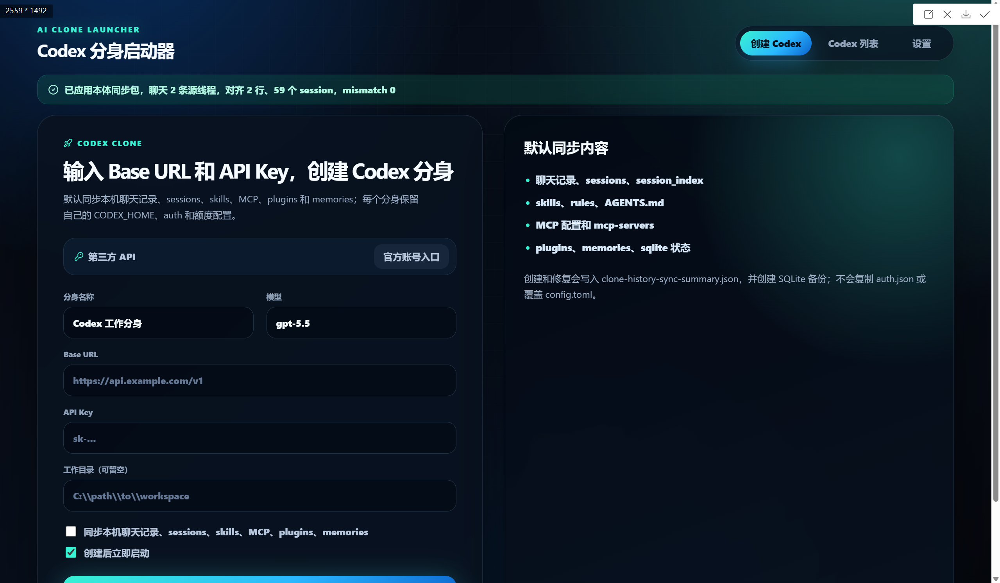

# Codex Clone Launcher

[中文](README.md)

Codex Clone Launcher is a desktop app for running multiple Codex Desktop clones on the same computer. Each clone uses its own isolated `CODEX_HOME`, so different clones can use different accounts or quota pools. When you choose to inherit data, the app can still synchronize useful local Codex conversations, memories, indexes, and local capabilities into the clone.

In short: keep Codex accounts and usage quotas separate, while keeping useful local history available across clones.



## Downloads

Get the latest Windows and macOS packages from [GitHub Releases](https://github.com/yq6666-66/codex-clone-launcher/releases/latest).

- Windows x64 portable build: `codex-clone-launcher_0.24.8_windows_x64_portable.zip`
- macOS universal DMG: `codex-clone-launcher_0.24.8_macos_universal.dmg`

Note: `v0.24.8` is the release package version. Some existing app binaries may still show `0.24.7` internally.

## Features

- Create, launch, stop, and delete Codex Desktop clones.
- Keep every clone in a separate `CODEX_HOME`, allowing different accounts and quota pools.
- Inherit local Codex data without copying source authentication secrets.
- Copy and repair history artifacts such as `sessions`, `state_5.sqlite`, `session_index.jsonl`, `memories`, and plugin cache.
- Align inherited `threads.model_provider` and `threads.model` values to the clone's current `config.toml`.
- Update session JSONL metadata and rebuild `session_index.jsonl` so inherited conversations appear in Codex Desktop.
- Show history health, thread count, provider/model mismatch, verification, sync, and repair status in the clone list.
- Detect Codex Desktop on Windows and refresh Codex app-server metadata for cloned profiles.

## Usage Notes

- Start a new conversation inside the clone. Continuing an old conversation may still use the original Codex session or quota.
- If Codex shows Not Responding, wait for a while and choose to wait for the app when Windows prompts you. Do not close it immediately.
- Loading the sync package, plugins, skills, or history data may cause a short pause.
- If history, skills, MCP, plugins, or memories do not appear, refresh/extract the source sync package first, then run sync/repair.

## Privacy Boundary

The app is designed around a strict privacy boundary: history sync should not copy authentication secrets. This repository is source code only. Do not commit local runtime data, including:

- `auth.json`
- `config.toml`
- `state_5.sqlite`
- `sessions/`
- `memories/`
- API keys, OAuth tokens, refresh tokens, or copied account data
- history sync backups or manifests from a real profile

The history sync logic is designed to copy conversation and index artifacts without copying source authentication secrets.

## Platform Notes

- Windows: the current release provides a Windows x64 portable build.
- macOS: the current release provides a universal DMG for Apple Silicon and Intel Macs.
- macOS packages are not currently notarized with an Apple Developer ID, so Gatekeeper may require right-clicking the app and choosing `Open`.

## Development

```powershell
npm ci
npm run verify
```

Run the desktop app in development mode:

```powershell
npm run tauri:dev
```

Build the desktop app:

```powershell
npm run tauri build
```

## License

MIT
