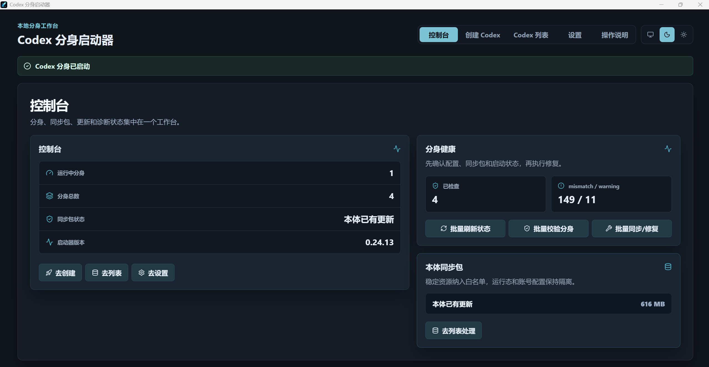

# Codex Clone Launcher

[English](README.md) | [简体中文](README.zh-CN.md)

Codex Clone Launcher is a small Tauri desktop app for creating isolated Codex Desktop profiles. Each clone gets its own `CODEX_HOME`, so different clones can use different accounts or quota pools while applying a manually extracted sync package when you choose to inherit local data.

## Project Status

- Primary target: Windows desktop.
- Release channel: GitHub Releases with Tauri updater metadata.
- Source builds: supported through Node.js, Rust, and Tauri prerequisites.
- Scope: Codex clone/profile/history workflows only.

## Interface Preview



## Features

- Create, launch, stop, and delete Codex Desktop clones.
- Keep each clone in an isolated `CODEX_HOME`.
- Use separate official OpenAI/Codex accounts or third-party OpenAI-compatible API keys per clone.
- Bridge Chat Completions-only providers such as Gemini/Claude-compatible gateways into the Responses wire protocol expected by Codex.
- Launch Windows clones with an elevated sandbox configuration so the Codex app can continue after sandbox setup.
- Manually extract a local Codex sync package before applying it to clones.
- Copy only stable local artifacts such as `sessions`, `state_5.sqlite`, `session_index.jsonl`, `memories`, `skills`, `rules`, `AGENTS.md`, and `mcp-servers`.
- Exclude runtime state such as `auth.json`, `.credentials.json`, `plugins`, `cache`, `log`, `.tmp`, and quota configuration.
- Back up the previous sync package before replacing it.
- Align inherited `threads.model_provider` and `threads.model` values to the clone's current `config.toml`.
- Update session JSONL metadata and rebuild `session_index.jsonl` so inherited conversations appear in Codex Desktop.
- Share local skills, MCP configuration, memories, and conversation indexes without copying account secrets.
- Check clone health, model/provider alignment, sync-package freshness, and sandbox readiness from the dashboard.
- Show history health, verification, sync, and repair status in the clone list.
- Check signed GitHub Releases from inside the app and install updates through Tauri Updater.

## App Workflow

1. Open **Settings** and confirm the launch path points to the desktop `Codex.exe`.
2. Open **Create Codex** and create a clone with either a Base URL + API Key or an official OpenAI/Codex account.
3. Open **Codex List** and click **Extract/Refresh Source** to create the local source sync package.
4. Click **Sync/Repair** on a clone to apply the existing sync package to that clone.
5. Click **Verify** or **Refresh Status** to confirm history alignment before launching the clone.
6. Use **Settings > App Update** to check GitHub Releases and install a newer signed version.

The launcher follows a conservative safety model: visual configuration, explicit manual switching, backup before replacement, and separate verification/repair steps. It stays focused on Codex clone/profile workflows.

## Install From Source

Prerequisites:

- Node.js LTS with `npm`
- Rust stable toolchain
- Tauri system prerequisites for your OS

```powershell
git clone https://github.com/yq6666-66/codex-clone-launcher.git
cd codex-clone-launcher
npm ci
npm run tauri:dev
```

Optional local environment variables are documented in `.env.example`.

Build the desktop app:

```powershell
npm run tauri -- build
```

On Windows, you can create a desktop shortcut for a source checkout:

```powershell
.\scripts\create-windows-shortcut.ps1
```

The shortcut is named `Codex 分身启动器.lnk` by default. It runs `scripts\start-codex-clone-launcher.ps1`, which installs dependencies when needed, rebuilds the release executable when sources are newer than the local build stamp, and starts `target\release\codex-clone-launcher.exe`.

Verify the shortcut target, arguments, working directory, and icon wiring:

```powershell
npm run verify:windows-shortcut
```

## In-App Updates

The app uses Tauri Updater with a build-time generated GitHub Releases endpoint. `npm run sync-version` writes both `src-tauri/tauri.conf.json` and `src/generated/updater.ts` before production builds.

Endpoint resolution order:

1. `UPDATER_ENDPOINT`, when you need to use a fully custom `latest.json` URL.
2. `UPDATER_OWNER_REPO`, for example `your-name/codex-clone-launcher`.
3. GitHub Actions `GITHUB_REPOSITORY`.
4. `package.json` `repository.url`.
5. The upstream default repository.

For a fork, set `UPDATER_OWNER_REPO` in CI or update `package.json` repository metadata so the built app checks your own GitHub Releases instead of the upstream project.

Release builds must be signed with the updater private key. The public key is stored in `src-tauri/tauri.conf.json`; keep the private key out of git and add it to GitHub Actions as `TAURI_SIGNING_PRIVATE_KEY`. If the key has a password, add `TAURI_SIGNING_PRIVATE_KEY_PASSWORD`.

Do not store updater signing keys in `.env` files.

The release workflow `.github/workflows/release.yml` publishes Windows installer assets and `latest.json` when you push a tag matching `package.json`, such as `vX.Y.Z`. The app diagnoses common updater failures in the UI, including missing `latest.json`, signature/public-key mismatch, GitHub network failures, and relaunch failures after a successful install.

Portable `.zip` builds are useful for manual download, but they are not treated as valid automatic updater packages by default. Publish a signed NSIS `.exe` or MSI `.msi` installer for automatic updates.

Typical release flow:

```powershell
npm version X.Y.Z --no-git-tag-version
npm run sync-version
npm run verify
git commit -am "chore: release vX.Y.Z"
git tag vX.Y.Z
git push origin main --tags
```

`npm run verify` covers TypeScript, production frontend build, Rust tests, UI smoke/regression, mocked Tauri UI workflows for clone creation/sync/update failure states, release workflow hardening, and Windows shortcut wiring.

Before treating a GitHub Release as updater-ready, run:

```powershell
npm run verify:updater-release -- --owner-repo your-name/codex-clone-launcher --tag vX.Y.Z
```

This fails fast if the release is missing `latest.json`, a Windows platform URL, an updater signature, or an installer asset suitable for Tauri Updater.

Optional production telemetry is disabled unless `VITE_SENTRY_DSN` is set. Configure these GitHub Actions secrets/variables only for public release builds that should report updater/UI errors:

- `VITE_SENTRY_DSN`
- `VITE_SENTRY_RELEASE`, or let the workflow set `codex-clone-launcher@${{ github.ref_name }}`

Telemetry is not required for development or forks. Do not include API keys, OAuth tokens, `auth.json`, `.credentials.json`, raw `sessions`, or SQLite profile data in public issues.

## Usage Notes

- Open a new conversation inside a clone after syncing; continuing an old conversation can still use old session metadata from the source conversation.
- During sync-package extraction, repair, skill/MCP loading, or history rebuild, the UI may pause briefly. Wait for the in-app processing notice to finish.
- If Codex appears unresponsive during launch, wait for the system chooser dialog and select the app instead of closing it.
- If history, skills, MCP, plugins, or memories do not appear, refresh/extract the source sync package first, then run **Sync/Repair** on the clone.

## Privacy Boundary

This repository is source code only. Do not commit local runtime data, including:

- `auth.json`
- `config.toml`
- `state_5.sqlite`
- `sessions/`
- `memories/`
- API keys, OAuth tokens, refresh tokens, or copied account data
- `plugins/`, `cache/`, `log/`, or `.tmp/`
- history sync backups or manifests from a real profile

The history sync logic is designed to copy conversation and index artifacts without copying source authentication secrets.

## Development

```powershell
npm ci
npm run verify
```

Run the desktop app in development mode:

```powershell
npm run tauri:dev
```

Build the desktop app:

```powershell
npm run tauri -- build
```

Create a shortcut somewhere else:

```powershell
.\scripts\create-windows-shortcut.ps1 -ShortcutPath "$env:USERPROFILE\Desktop\Codex 分身启动器.lnk"
```

## Repository Map

- `src`: React frontend.
- `src-tauri`: Tauri desktop shell and Rust commands.
- `scripts`: local build, version sync, release verification, and Windows shortcut helpers.
- `docs`: product and operations notes.
- `.github/workflows`: CI and release automation.

See [docs/codex-clone-launcher.md](docs/codex-clone-launcher.md) for the detailed product and data-boundary guide.

## License

MIT
