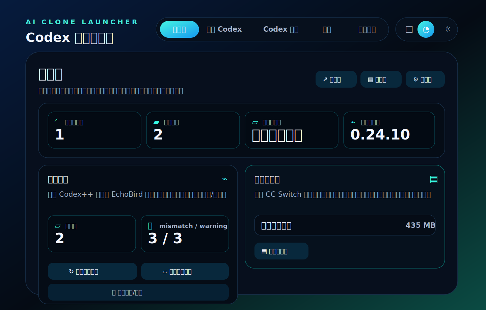

# Codex 分身启动器

[English](README.md) | [简体中文](README.zh-CN.md)

Codex 分身启动器是一个小型 Tauri 桌面应用，用于创建相互隔离的 Codex Desktop 分身。每个分身都有独立的 `CODEX_HOME`，可以使用不同账号或额度池；只有在你明确选择继承本地数据时，才会应用手动提取的同步包。

## 项目状态

- 主要目标平台：Windows 桌面端。
- 发布通道：GitHub Releases，包含 Tauri updater 元数据。
- 源码构建：支持通过 Node.js、Rust 和 Tauri 前置环境构建。
- 范围：仅聚焦 Codex 分身、配置档案、历史记录和同步修复流程。

## 界面预览



## 功能

- 创建、启动、停止和删除 Codex Desktop 分身。
- 每个分身使用独立的 `CODEX_HOME`。
- 在应用到分身之前，手动提取本地 Codex 同步包。
- 只复制稳定本地资源，例如 `sessions`、`state_5.sqlite`、`session_index.jsonl`、`memories`、`skills`、`rules`、`AGENTS.md` 和 `mcp-servers`。
- 排除运行态数据，例如 `auth.json`、`.credentials.json`、`plugins`、`cache`、`log`、`.tmp` 和额度配置。
- 替换同步包前自动备份旧包。
- 将继承的 `threads.model_provider` 和 `threads.model` 对齐到分身当前 `config.toml`。
- 更新 session JSONL 元数据并重建 `session_index.jsonl`，让继承会话能出现在 Codex Desktop 中。
- 在分身列表中展示历史健康、校验、同步和修复状态。
- 在应用内检查已签名的 GitHub Releases，并通过 Tauri Updater 安装新版本。

## 使用流程

1. 打开 **设置**，确认启动路径指向桌面端 `Codex.exe`。
2. 打开 **创建 Codex**，使用 Base URL + API Key 或官方 OpenAI/Codex 账号创建分身。
3. 打开 **Codex 列表**，点击 **提取/刷新本体** 创建本地源同步包。
4. 对目标分身点击 **同步/修复**，把现有同步包应用到该分身。
5. 点击 **校验** 或 **刷新状态**，确认历史记录对齐后再启动分身。
6. 使用 **设置 > 应用更新** 检查 GitHub Releases 并安装新的签名版本。

启动器采用保守安全模型：可视化配置、显式手动切换、替换前备份、独立校验/修复步骤，并始终聚焦 Codex 分身流程。

## 从源码安装

前置要求：

- Node.js LTS 和 `npm`
- Rust stable toolchain
- 目标系统对应的 Tauri 前置环境

```powershell
git clone https://github.com/yq6666-66/codex-clone-launcher.git
cd codex-clone-launcher
npm ci
npm run tauri:dev
```

可选本地环境变量见 `.env.example`。

构建桌面应用：

```powershell
npm run tauri -- build
```

Windows 上可以为源码 checkout 创建桌面快捷方式：

```powershell
.\scripts\create-windows-shortcut.ps1
```

快捷方式会运行 `scripts\start-codex-clone-launcher.ps1`。该脚本会在需要时安装依赖；当源码比本地构建标记更新时，重新构建 release 可执行文件；然后启动 `target\release\codex-clone-launcher.exe`。

## 应用内更新

应用使用 Tauri Updater，并在构建时生成 GitHub Releases 更新端点。`npm run sync-version` 会在生产构建前写入 `src-tauri/tauri.conf.json` 和 `src/generated/updater.ts`。

端点解析顺序：

1. `UPDATER_ENDPOINT`，用于完整自定义 `latest.json` URL。
2. `UPDATER_OWNER_REPO`，例如 `your-name/codex-clone-launcher`。
3. GitHub Actions 的 `GITHUB_REPOSITORY`。
4. `package.json` 的 `repository.url`。
5. 上游默认仓库。

如果你 fork 了项目，请在 CI 中设置 `UPDATER_OWNER_REPO`，或更新 `package.json` 的仓库元数据，让构建出的应用检查你自己的 GitHub Releases，而不是上游项目。

Release 构建必须使用 updater 私钥签名。公钥存放在 `src-tauri/tauri.conf.json`；私钥不要提交到 git，应添加到 GitHub Actions secret：`TAURI_SIGNING_PRIVATE_KEY`。如果私钥有密码，还要添加 `TAURI_SIGNING_PRIVATE_KEY_PASSWORD`。

不要把 updater 签名密钥存入 `.env` 文件。

发布 workflow `.github/workflows/release.yml` 会在推送与 `package.json` 匹配的 tag 时发布 Windows NSIS 安装器和 `latest.json`，例如 `vX.Y.Z`。应用会在 UI 中诊断常见更新失败，包括缺少 `latest.json`、签名/公钥不匹配、GitHub 网络失败，以及安装成功后重启失败。

便携 `.zip` 适合手动下载，但默认不作为自动更新包。自动更新请发布已签名的 NSIS `.exe` 安装器。校验脚本仍支持 MSI，但公开 workflow 默认构建 NSIS，以避开 GitHub Windows runner 上的 WiX 打包失败。

典型发布流程：

```powershell
npm version X.Y.Z --no-git-tag-version
npm run sync-version
git commit -am "chore: release vX.Y.Z"
git tag vX.Y.Z
git push origin main --tags
```

把 GitHub Release 当作 updater 可用版本前，运行：

```powershell
npm run verify:updater-release -- --owner-repo your-name/codex-clone-launcher --tag vX.Y.Z
```

如果 release 缺少 `latest.json`、Windows 平台 URL、updater 签名或适合 Tauri Updater 的安装器资源，该命令会直接失败。

可选生产遥测默认关闭，只有设置 `VITE_SENTRY_DSN` 时才启用。仅在公开发布版本需要上报 updater/UI 错误时配置这些 GitHub Actions secrets/variables：

- `VITE_SENTRY_DSN`
- `VITE_SENTRY_RELEASE`，或让 workflow 自动设置为 `codex-clone-launcher@${{ github.ref_name }}`

开发环境和 fork 不需要遥测。不要在公开 issue 中提交 API keys、OAuth tokens、`auth.json`、`.credentials.json`、原始 `sessions` 或 SQLite 配置档案数据。

## 使用注意

- 同步后请在分身里开启新对话；继续旧对话仍可能使用源会话的旧 metadata。
- 在提取同步包、修复、加载 skill/MCP 或重建历史索引时，界面可能短暂停顿，请等待应用内处理提示结束。
- 如果 Codex 启动时看起来没有响应，等待系统选择器弹窗并选择应用，不要直接关闭。
- 如果历史、skills、MCP、plugins 或 memories 没出现，先刷新/提取本体同步包，再对分身执行 **同步/修复**。

## 隐私边界

本仓库只包含源码。不要提交本地运行数据，包括：

- `auth.json`
- `config.toml`
- `state_5.sqlite`
- `sessions/`
- `memories/`
- API keys、OAuth tokens、refresh tokens 或复制的账号数据
- `plugins/`、`cache/`、`log/` 或 `.tmp/`
- 真实 profile 产生的历史同步备份或 manifest

历史同步逻辑的目标是复制会话和索引资源，不复制源 profile 的认证密钥。

## 开发

```powershell
npm ci
npm run verify
```

以开发模式运行桌面应用：

```powershell
npm run tauri:dev
```

构建桌面应用：

```powershell
npm run tauri -- build
```

在其他位置创建快捷方式：

```powershell
.\scripts\create-windows-shortcut.ps1 -ShortcutPath "$env:USERPROFILE\Desktop\Codex Clone Launcher.lnk"
```

## 仓库结构

- `src`：React 前端。
- `src-tauri`：Tauri 桌面壳和 Rust commands。
- `scripts`：本地构建、版本同步、release 校验和 Windows 快捷方式辅助脚本。
- `docs`：产品和运维说明。
- `.github/workflows`：CI 和 release 自动化。

详细产品和数据边界说明见 [docs/codex-clone-launcher.md](docs/codex-clone-launcher.md)。

## 许可证

MIT
